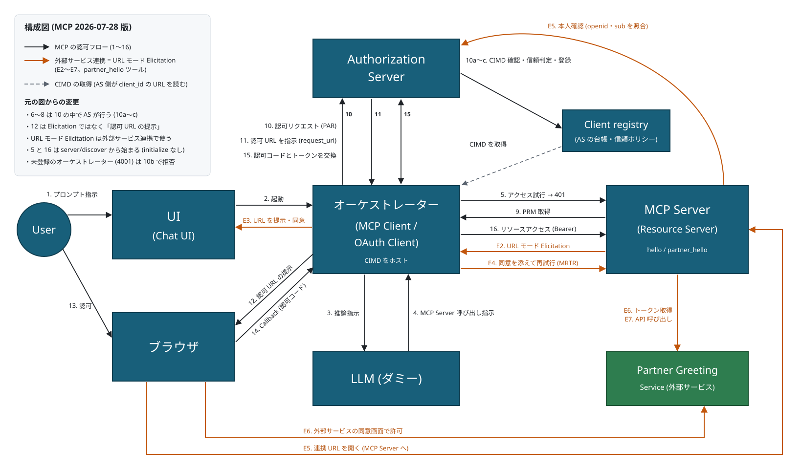

# MCP + OAuth 2.1 + CIMD + PRM デモ

添付の構成図を、最新の MCP 仕様に沿う形で動かせるようにした実装です。Chat UI から
プロンプトを送ると、ダミー LLM が MCP サーバーのツール呼び出しを指示し、未認証のアクセス試行から
OAuth 2.1 の認可フローが始まり、最終的に「Hello, 〇〇!」が返ってきます。

さらに、URL モードの Elicitation を **本来の用途** (MCP サーバーが外部サービスの認可を必要とする場面)
で体験できるシナリオも入っています。

すべてのコンポーネントは独立したプロセスとして起動し、**コンポーネント間は実際の HTTP
で通信します**(モックした関数呼び出しではありません)。

## 構成図



黒い矢印が MCP の認可フロー (1〜16)、オレンジの矢印が外部サービス連携 (URL モード Elicitation、E2〜E7)、
破線が CIMD の取得です。元の図との違い (6〜8 を 10 に統合、12 を「認可 URL の提示」に変更) の理由は
[設計上の判断](#設計上の判断) を、各番号の実装箇所は [図の番号と実装の対応](#図の番号と実装の対応) を参照してください。

## 準拠している仕様

2026-09 時点の最新版に合わせています。

| 仕様 | 版 | 実装箇所 |
| --- | --- | --- |
| MCP (Streamable HTTP, tools, Elicitation) | **2026-07-28** (ステートレス版) | `src/mcp-server/server.ts` / `src/orchestrator/mcp-client.ts` |
| MCP TypeScript SDK | v2.0.0 (`@modelcontextprotocol/server` / `client` / `node`) | 同上 |
| OAuth 2.1 (authorization code + PKCE 必須、implicit/password なし) | draft-ietf-oauth-v2-1 | `src/auth-server/server.ts` |
| Client ID Metadata Document (CIMD) | draft-ietf-oauth-client-id-metadata-document-02 | `src/orchestrator/server.ts` (公開) / `src/client-registry/server.ts` (取得・検証) |
| Protected Resource Metadata | RFC 9728 | `src/mcp-server/server.ts` (公開) / `src/orchestrator/oauth-client.ts` (取得) |
| Authorization Server Metadata | RFC 8414 (+ OIDC Discovery への探索) | `src/auth-server/server.ts` / `src/orchestrator/oauth-client.ts` |
| Pushed Authorization Request | RFC 9126 | 図の 10 → 11 |
| Resource Indicators | RFC 8707 | `resource` パラメータとトークンの `aud` |
| Authorization Server Issuer Identification | RFC 9207 | callback の `iss` 検証 |
| Bearer Token Usage | RFC 6750 | MCP Server の 401 / 403 |
| JWT Access Token | RFC 9068 | `typ: at+jwt` の発行と検証 |

### 最新仕様に合わせて修正した点

| 対象 | 修正内容 | 根拠 |
| --- | --- | --- |
| MCP | `initialize` ハンドシェイクを廃止し、全リクエストに `_meta` (プロトコル版・クライアント情報・能力) を付与。接続は `server/discover` から | MCP 2026-07-28 |
| MCP | `Mcp-Method` / `Mcp-Name` / `MCP-Protocol-Version` ヘッダとボディの一致を検証 (不一致は `-32020`) | MCP 2026-07-28 |
| MCP | 結果に `resultType`、`tools/list` に `ttlMs` / `cacheScope` を付与 | MCP 2026-07-28 |
| MCP | サーバーからの入力要求は MRTR (`input_required` → 再試行) で扱う | MCP 2026-07-28 |
| MCP | MCP Server で Origin / Host を検証 (DNS リバインディング対策)、全サービスを 127.0.0.1 のみに bind | MCP Streamable HTTP (MUST / SHOULD) |
| 401 応答 | トークンが無い場合は `error` を付けない。必要なスコープ `scope` を付ける | RFC 6750 §3.1 / MCP Scope Selection Strategy |
| クライアント | 要求スコープを「401 の scope → PRM の scopes_supported → 省略」の順で決定 | MCP Scope Selection Strategy |
| クライアント | AS メタデータ探索を仕様の優先順 (OAuth → OIDC、パス差し込み含む) に変更 | MCP 認可仕様 |
| クライアント | AS が `code_challenge_methods_supported` (S256) を示さなければ中止 | MCP 認可仕様 (MUST) |
| クライアント | `iss` の検証を判定表どおりに (AS が対応を宣言しているのに `iss` が無ければ拒否) | RFC 9207 / MCP 認可仕様 |
| クライアント | トークンを AS (issuer) ごとに分けて保持。401 で拒否されたら破棄して再認可 | MCP 認可仕様 |
| AS | PAR を `application/x-www-form-urlencoded` のみ受け付ける | RFC 9126 §2.1 |
| AS | トークン / PAR 応答に `Cache-Control: no-store` | OAuth 2.1 |
| AS | 同意画面で戻り先のホスト名を明示し、localhost のみの戻り先には警告 | MCP 認可仕様 (MUST / SHOULD) |
| AS | CIMD の取得・検証と信頼ポリシーの判定を、認可リクエスト (PAR) の中で AS 自身が行う (元の図の 6〜8) | MCP 認可仕様 / CIMD |
| CIMD | client_id の検証を強化 (path 必須、`.` `..` 禁止、query 不可) | CIMD draft-02 |
| CIMD | 特殊用途アドレスからの取得を禁止 (開発時のループバックのみ明示的に許可)、5KB 上限、200 以外は失敗、リダイレクトを追わない、Cache-Control を尊重 | CIMD draft-02 |
| CIMD | `client_name` を必須化、`client_secret` や共有鍵方式・秘密鍵を拒否、redirect_uri は localhost か https のみ | MCP 認可仕様 / CIMD draft-02 |
| Elicitation | URL モードをクライアント自身の認可に使うのをやめ (図の 12)、本来の用途である外部サービス連携で使う | MCP Elicitation (URL モードは MCP 認可に使えない) |

## 構成

| コンポーネント | ポート | 役割 |
| --- | --- | --- |
| Chat UI | 4000 | オーケストレーターが配信。SSE でフローを可視化 |
| オーケストレーター（信頼できる） | 4000 | MCP Client / OAuth Client。CIMD をホストし、callback を受ける |
| オーケストレーター（信頼できない） | 4001 | 同じ実装。CIMD は公開するが、信頼ポリシー (許可リスト) に載っていない |
| LLM (ダミー) | 4100 | ルールベースでツール呼び出しと最終回答を返すだけ |
| MCP Server (Resource Server) | 4200 | `hello` / `partner_hello` ツール。PRM 公開、Bearer 検証、外部サービス連携 |
| Authorization Server | 4300 | PAR / 認可 / トークン発行。CIMD でクライアントを識別。本人確認 (`openid`) にも対応 |
| Client registry | 4400 | AS の台帳。CIMD の取得・検証・キャッシュ、許可リストと登録状態の保持 |
| Partner Greeting Service | 4500 | 外部サービス (独自の AS + 挨拶 API)。MCP とは無関係の第三者 |

## 動かし方

```bash
npm install
npm run dev
```

ブラウザで <http://localhost:4000> を開いて、プロンプトを送信します。

| プロンプトの例 | 使うツール | 体験できること |
| --- | --- | --- |
| 太郎さんに挨拶して | `hello` | MCP の認可 (図の 1〜16) |
| パートナー経由で太郎さんに挨拶して | `partner_hello` | 上記に加えて、URL モードの Elicitation による外部サービス連携 (E1〜E7) |

右ペインに図の番号に対応したフローが出ます。AS の内部処理 (10a〜10c) やブラウザ側の連携
(E5〜E7) は、ターミナルの `[auth]` `[registry]` `[mcp]` `[partner]` のログで追えます。

ブラウザを使わずに一通り流すこともできます:

```bash
npm run smoke
```

外部サービス連携のシナリオ:

```bash
npm run smoke:partner
```

型チェック:

```bash
npm run typecheck
```

## 図の番号と実装の対応

元の図から 2 か所を、最新の仕様に合わせて変えています (理由は「設計上の判断」を参照)。

| # | 内容 | 実装 |
| --- | --- | --- |
| 1 | プロンプト指示 (ユーザー → Chat UI) | `public/index.html` の送信フォーム |
| 2 | 起動 (Chat UI → オーケストレーター) | `POST /api/chat` |
| 3 | 推論指示 | `POST http://localhost:4100/v1/infer` |
| 4 | MCP Server 呼び出し指示 | ダミー LLM が `tool_calls` を返す |
| 5 | アクセス試行 | トークン無しで MCP `server/discover` を POST → **401 + WWW-Authenticate** (`scope` / `resource_metadata`) |
| ~~6〜8~~ | ~~CIMD 確認・返却・クライアント登録~~ | **10 の中で AS が行う** (10a〜10c) |
| 9 | PRM 取得 | 401 の `resource_metadata` を辿って PRM を取得 |
| 10 | 認可リクエスト | AS の PAR エンドポイントに push。AS は 10a: CIMD の取得・検証 → 10b: 信頼ポリシー (許可リスト) の確認 → 10c: 未登録なら台帳に登録 |
| 11 | 認可 URL を指示 | AS が `request_uri` を返し、そこから認可 URL を組み立てる |
| 12 | **認可 URL の提示** (元は Elicitation URL Mode) | 開く先のホストと URL 全体を示し、ユーザーの操作でブラウザを開く |
| 13 | 認可 | AS の同意画面。表示内容は CIMD 由来 |
| 14 | Callback (認可コード) | `GET /oauth/callback` で `state` と `iss` を検証 |
| 15 | 認可コードとトークンを交換 | `POST /token` (PKCE 検証 + CIMD と登録状態の再確認) |
| 16 | リソースアクセス | Bearer 付きで MCP 接続 (`server/discover`) → `tools/list` → `tools/call` |

### 外部サービス連携 (URL モード Elicitation の本来の用途)

`partner_hello` ツールは、MCP Server が外部サービス (Partner Greeting Service) の API を
ユーザーの代わりに呼ぶ例です。MCP Server は外部サービスの **OAuth クライアント** になり、
外部サービスの認可はユーザーがブラウザで直接行います。

| # | 内容 | 実装 |
| --- | --- | --- |
| E1 | LLM が `partner_hello` を指示 | ダミー LLM (「外部」「パートナー」を含むプロンプト) |
| E2 | MCP Server が `input_required` を返す | `elicitation/create` (mode: `url`)。`requestState` は HMAC で保護し、ユーザー (`sub`) に束縛 |
| E3 | クライアントが URL を示して同意を求める | 依頼元サーバー・開く先のドメイン・URL 全体を表示し、同意 / 拒否 / キャンセル |
| E4 | 同意を添えて `tools/call` を再試行 (MRTR) | SDK が自動で再試行。サーバーはブラウザでの連携完了を待つ |
| E5 | 連携 URL を開いた人の本人確認 | MCP Server が MCP の AS に `openid` で問い合わせ、ID トークンの `sub` を照合 (**フィッシング対策**) |
| E6 | 外部サービスの認可 | 外部サービスの同意画面 → トークンを MCP Server がユーザーに紐付けて保存 |
| E7 | 外部 API 呼び出し | 待っていた再試行の中で API を呼び、結果を返す |

外部サービスのトークンは MCP Server だけが持ち、**MCP クライアントには渡しません** (仕様の MUST)。

#### フィッシング対策を試す

連携 URL を攻撃者が別のユーザーに開かせても、本人確認 (E5) で `sub` が一致しないため中止されます。
AS のデモユーザーは 2 人 (山田 太郎 / 佐藤 花子) いて、AS の `/session` で切り替えられます。

```bash
npm run smoke -- --phishing
```

太郎として始めた連携の URL を花子として開くと **403 で中止され**、太郎として開き直すと完了することを確かめます。
(外部サービスとの連携状態は MCP Server のメモリにあるので、もう一度試すときは再起動してください。)

## 信頼できないオーケストレーターで試す

ヘッダーの「オーケストレーター」の設定で、リクエストを投げる先を切り替えられます。

| 選択肢 | client_id | 結果 |
| --- | --- | --- |
| 信頼できるオーケストレーター (4000) | `http://localhost:4000/oauth/client-metadata.json` | 認可され、`Hello, 〇〇!` が返る |
| 信頼できないオーケストレーター (4001) | `http://localhost:4001/oauth/client-metadata.json` | **PAR (10) で拒否され、ツールを実行できない** |

2 つのオーケストレーターは**実装が全く同じ**で、違うのは名乗る `client_id` と
待ち受けポートだけです (`ORCHESTRATOR_VARIANT` 環境変数で切り替え)。
それでも結果が変わるのは、AS の信頼ポリシー (`TRUSTED_CLIENT_IDS` in `src/shared/config.ts`)
に 4000 番しか載っていないためです。

信頼できない側で起こること:

1. 10a: CIMD 自体は正しく取得・検証できる (「Unknown Orchestrator (未登録)」と認識される)
2. 10b: 信頼ポリシーに無いので、**AS が `invalid_client` で拒否**する
3. アクセストークンが出ないため、MCP のツールは実行されない

「CIMD が取得できること」と「そのクライアントを信頼してよいこと」は別だ、という点を
確認するための構成です。CIMD は名乗りの検証しかできず、受け入れるかどうかは AS の方針です
(CIMD 仕様の信頼ポリシー §6.4 / §6.8)。

```bash
npm run smoke:untrusted
```

(拒否されれば成功として exit 0 になります)

## Client ID Metadata Document の要点

クライアントの `client_id` は **メタデータ文書の URL そのもの** です。

```
client_id = http://localhost:4000/oauth/client-metadata.json
```

AS はこの URL を取得してクライアントを識別するので、動的クライアント登録 (DCR。
MCP 2026-07-28 で非推奨) は不要です。`src/client-registry/server.ts` では
draft-02 に沿って次を検証しています。

- `client_id` が https であること (ループバック上の開発環境に限り http を許容)
- path を含み、`.` `..` のセグメント・fragment・userinfo・query を含まないこと
- 取得先が特殊用途アドレス (RFC 6890) でないこと (SSRF 対策)
- 取得時にリダイレクトを追わず、200 以外は失敗、読み込みは 5KB まで
- **文書内の `client_id` が取得元 URL と完全一致すること**
- `client_name` と `redirect_uris` があり、redirect_uri は localhost か https であること
- `client_secret` や共有鍵方式の認証、秘密鍵を含まないこと
- キャッシュは `Cache-Control` を尊重し、エラーや不正な文書はキャッシュしない

## 確認済みの防御的な振る舞い

以下は実際に動かして確認しています。

- CIMD に登録されていない `redirect_uri` は PAR で拒否
- `code_challenge_method=plain` や不正な challenge は拒否 (S256 のみ)
- `resource` (RFC 8707) が無い認可リクエストは拒否
- PAR を JSON で送ると拒否 (フォーム形式のみ)
- `code_verifier` 不一致ではトークンを発行しない
- 認可コードと `request_uri` は 1 回だけ有効
- リフレッシュトークンはワンタイム (使用時にローテーション)
- **`aud` が別リソースのトークンは MCP Server が 401 で拒否** (トークンの使い回し防止)
- トークン無しの 401 には `error` を含めず、無効なトークンには `error="invalid_token"`
- `Mcp-Method` / `Mcp-Name` とボディの不一致は `-32020` で拒否、旧版の GET は 405
- 不正な Origin / Host は 403 (DNS リバインディング対策)
- CIMD の各種不正 (`..`・query・path 無し・非 https・特殊用途アドレス・CIMD でない URL) を拒否
- **信頼ポリシーに無いクライアントは、CIMD が正しくても認可されない**
- 手元のトークンが 401 で拒否されたら破棄して再認可する
- **連携 URL を別のユーザーが開くと、本人確認で 403 になり連携は中止される**
- URL モードの Elicitation を拒否すると、外部サービスには接続しない

## 設計上の判断

図には表現されていない部分や、最新仕様と図が食い違う部分について、次のように判断しました。

**1. 元の図の 6〜8 は、AS の中 (10) で行う形にしました**

元の図では、アクセス試行 (5) を受けた MCP Server が Client registry に CIMD を確認し、
未登録なら AS に登録していました。しかし MCP 仕様では CIMD を解決するのは AS であり、
トークンを持たない段階の MCP Server がクライアントの素性を知る標準の手段もありません。
そこで標準の流れに合わせ、AS が認可リクエスト (PAR) を受けた時点で CIMD を取得・検証し、
信頼ポリシーを確認して、未登録なら台帳 (Client registry) に登録するようにしました。

**2. 元の図の 12「Elicitation URL Mode」は「認可 URL の提示」にしました**

MCP 仕様は、URL モードの Elicitation を「MCP クライアント自身が MCP サーバーへの認可を
得るため」に使うことを明確に否定しています (MCP サーバーが自分のための認可に使っては
ならない = MUST NOT)。クライアント自身の認可は MCP 認可仕様の通常の流れで行うものです。
そこで 12 は通常の「認可 URL の提示」とし、URL を開く前に宛先を示して同意を得るという
安全策だけを残しました。

代わりに URL モードの Elicitation は、**本来の用途** (MCP サーバーが外部サービスの認可を
必要とする場面) で `partner_hello` ツールとして実装しています (E1〜E7)。

**3. 10 と 11 を PAR (RFC 9126) として実装しました**

「認可リクエスト → 認可 URL を指示」という往復は、クライアントが認可リクエストを AS に
push し、AS が `request_uri` を返す PAR とみなすのが自然だったためです。AS 側は
`require_pushed_authorization_requests: true` にしてあります。

**4. http のまま動かしています (開発用の例外)**

CIMD の `client_id` は https が必須 (MUST)、MCP 仕様では AS のエンドポイントも https が必須です。
このデモはローカルで手軽に動かすことを優先し、すべて `http://localhost` で動かしています。
CIMD の取得については draft-02 が認める「AS 自身がループバック上で動く開発環境に限り、
ループバックからの取得を許す」例外を、`DEV_ALLOW_LOOPBACK_CIMD` で明示的に有効にしています。
**本番では https にし、この例外は無効にしてください。**

**5. 外部サービス連携の本人確認は、MCP の AS の `openid` で行っています**

MCP 仕様は、連携を始めたユーザーと連携 URL を開いたユーザーが同一であることの確認を
求めています (MUST)。仕様の例に従い、MCP Server は連携 URL が開かれたら MCP の AS に
`scope=openid` で問い合わせ (MCP Server 自身も CIMD を公開したクライアント)、
ID トークンの `sub` を連携要求の `sub` と照合します。この AS は OpenID Provider の
完全な実装ではなく、本人確認に必要な最小限 (ID トークンと `nonce`) だけを持っています。

**6. LLM と MCP サーバーの中身はダミーです**

LLM は正規表現ベースでツールを選ぶだけ、MCP サーバーは挨拶を返すだけです。

**7. Chat UI への SSE はイベントを再送できるようにしています**

認可のためにブラウザが別ページへ移動すると SSE が切れて結果を取りこぼすため、
イベントにシリアル ID を振り、再接続時に `Last-Event-ID` 以降 (新規接続なら全履歴)
を送り直しています。これはアプリ内部の通信で、MCP のトランスポートではありません
(MCP 2026-07-28 の Streamable HTTP は再送の仕組みを廃止しています)。

## 本番運用では足りないもの

学習・検証用のデモなので、次は意図的に省いています。

- すべて **http / localhost** 前提です (上記 4)
- 認可サーバーと MCP Server の鍵はプロセス起動ごとに生成され、再起動で失効します
- ログインはデモユーザーを選ぶだけで、パスワード等の認証はありません
- 同意の永続化、スコープの絞り込み UI、トークン失効エンドポイントがありません
- トークン・認可コード・CIMD キャッシュ・外部サービスのトークンはすべてプロセス内メモリです
- CIMD 取得の SSRF 対策は名前解決の結果で判定しており、DNS rebinding までは防げません
- スコープ不足 (403 `insufficient_scope`) からの段階的な再認可 (step-up) は実装していません
  (このデモのスコープは 1 つだけのため)
- レート制限、監査ログ、同意画面の CSRF 対策がありません
